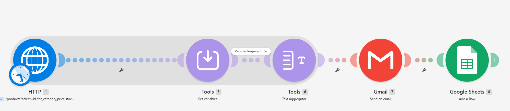
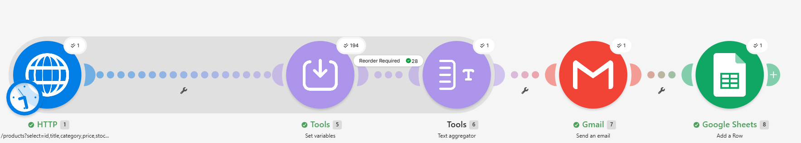
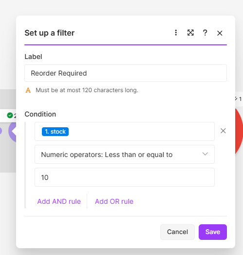
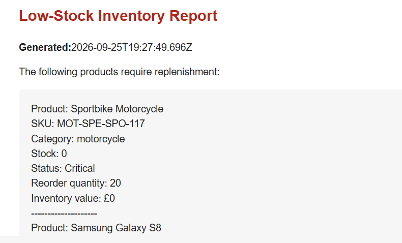
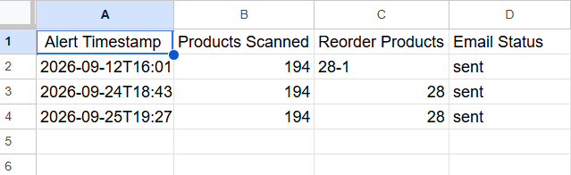

# Inventory Monitoring — Make.com

**Status:** Completed, tested, and sanitized for public portfolio use

A Make.com automation that retrieves product inventory from a public demo API, identifies low-stock products, calculates replenishment values, sends an HTML email report, and records each alert run in Google Sheets.

## Business problem

Manual inventory checks are slow and can allow popular products to run out. This workflow turns a product feed into a repeatable low-stock monitoring process and gives operations teams a clear replenishment report.

## Workflow

1. **HTTP** retrieves paginated product data from the public DummyJSON demo API.
2. **Tools — Set variables** calculates inventory value, reorder quantity, and stock status.
3. A **Reorder Required** filter keeps products where stock is less than or equal to 10.
4. **Text Aggregator** combines qualifying products into one report.
5. **Gmail** sends the formatted low-stock report.
6. **Google Sheets** records the alert timestamp, products scanned, reorder count, and delivery status.

## Stock logic

| Rule | Result |
| --- | --- |
| Stock 0–5 | Critical |
| Stock 6–10 | Low Stock |
| Stock above 10 | Healthy |
| Reorder target | 20 units |
| Reorder quantity | `20 - current stock` when stock is below 20 |
| Inventory value | `price × stock` |

## Demonstration results

The included successful run processed 194 public demo products and identified 28 products requiring reorder attention. These figures demonstrate the workflow and are not private business records.

## Screenshots

### Workflow overview

### Successful execution

### Reorder filter

### Low-stock email report

### Monitoring log

## Repository contents

- `workflow/inventory-monitoring.sanitised.json` — importable Make blueprint with credentials and personal identifiers removed
- `sample-data/example-alert-log.json` — fictional demonstration output
- `screenshots/` — privacy-checked project evidence
- `docs/setup.md` — safe import and configuration instructions

## Setup

See [docs/setup.md](docs/setup.md). After importing the blueprint, create your own Gmail and Google Sheets connections, replace the spreadsheet placeholders, choose your alert recipient, and test the scenario while it remains inactive.

## Privacy and security

This public portfolio copy does not include passwords, API keys, webhook secrets, personal email addresses, reusable connection IDs, or a live spreadsheet ID. The workflow uses a public demo API. Always inspect an exported blueprint again before publishing future updates.

## Possible extensions

- Schedule automatic daily monitoring.
- Add Slack or Microsoft Teams alerts.
- Use category-specific reorder thresholds.
- Store run failures in a dedicated error log.
- Connect a production inventory or ERP API.

## Author

Nayab Hasnain

## Licence

Copyright © 2026 Nayab Hasnain. All rights reserved. See [LICENSE.md](LICENSE.md).
